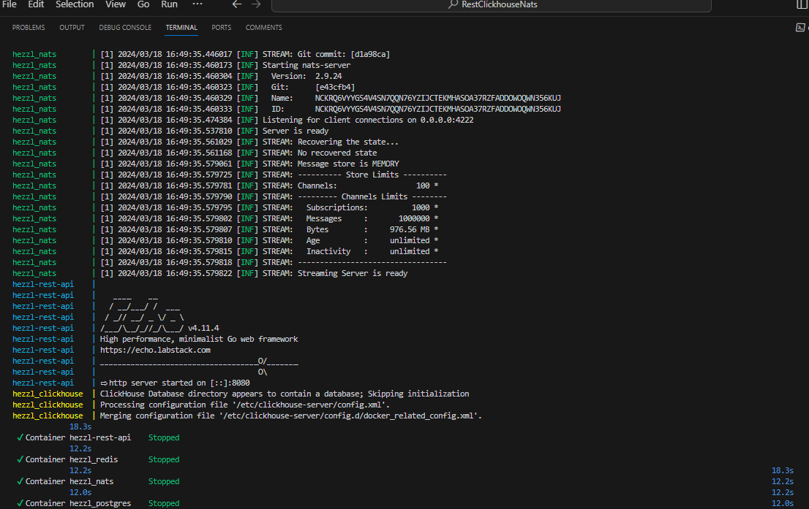

# Echo-Nats
Тестовое задание от Hezzl.com
## О проекте
- Проект создан на Golang, Postgres, Clickhouse, Nats, Redis
- Описаны модели данных и миграции
- Для обращения в БД использованы raw sql запросы
## Инструкция к запуску
Для запуска проекта требуется docker-compose.

`docker-compose up --build --remove-orphans` или `make run`

Далее запустите миграции. 

`make postgres-up`

При необходимости в Docker-compose.yml могут быть добавлены клиентские службы для Clickhouse
## API
Endpoint = `http://localhost:8080/`

## A picture is worth a thousand words

